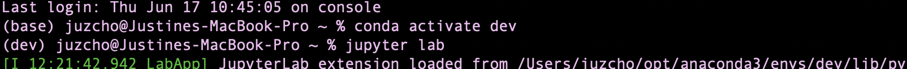
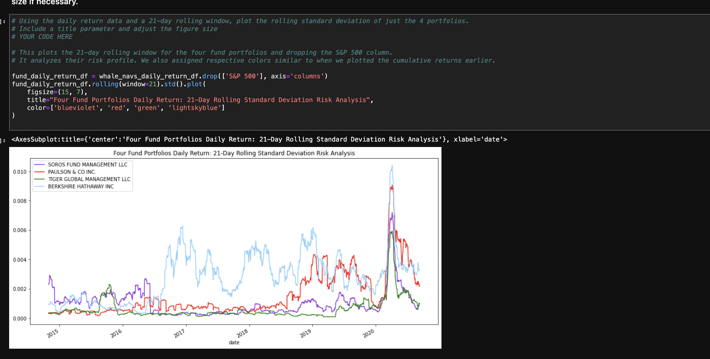

# **Risk Return Analysis**

## Overview

The Risk Return Analysis project is about understanding the different stock prices and how each compares to the market which is S&P 500. It analyzes how volatile each stock is compared to the market, as well as how much risk and return it might yield for investing in such stock. It gives us a visual analysis for better understanding of each stock.

---

## Technologies

This project leverages **[python version 3.8.5](https://www.python.org/downloads/)** with the following packages and modules:

* [pandas](https://pandas.pydata.org/docs/) - This was used to be able to easily manipulate dataframes.

* [pathlib](https://docs.python.org/3/library/pathlib.html) - This was used to locate through the directory or file path. Also, it converts a string and converts that supplied string as a PosixPath that can be utilize by other functions such as reading or writing files to csv files.

* [Jupyter Lab](https://jupyterlab.readthedocs.io/en/stable/) - This was used to be able to create and share documents that contain live code, equations, visualizations and narrative text.

* [numpy](https://numpy.org/install/) - This was used in calculating a square root of one of the arrays we have on the iPython notebook.

* [matplotlib inline](https://github.com/ipython/matplotlib-inline) - This is used on the iPython Notebook. It allows us to add plots to the browser interface.
---

## Installation Guide and Running Jupyter Notebook

### Installing Jupyter notebook

On the terminal, under the conda dev environment, type the code below:

`pip install jupyterlab`

---
### Opening Jupyter notebook

If you have Jupyter Lab already installed, to open your Notebook, please type this while on your conda dev environment:

`jupyter lab` 

Once you click ENTER, this will open on your default browser.

----

---

## Examples

This image below shows how a line graph of how each fund portfolio compares to one another.

---

## Contributors

Contributed by: Justine Cho

Email: chojustine0@gmail.com

[ LinkedIn](https://www.linkedin.com/in/justinecho)

